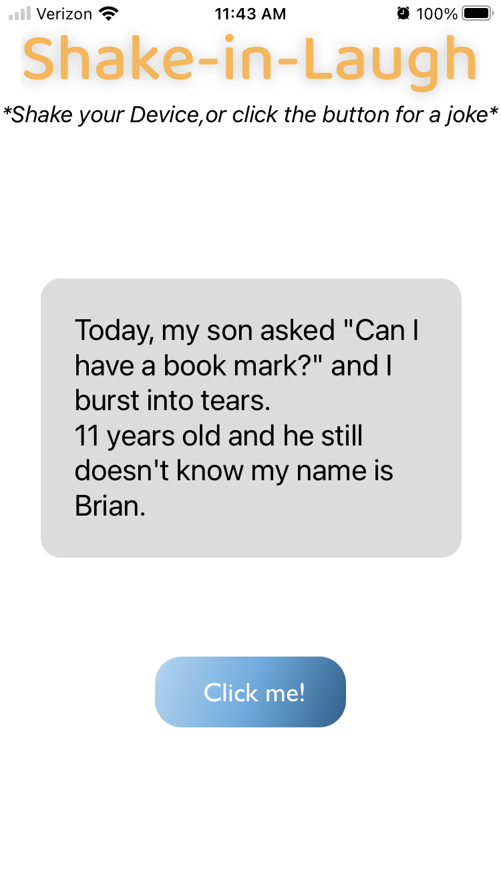

# Shake-in-Laugh
## Summery
Using react-native to generate a random joke from a third party API. 

Languages and Tools used: React Native, Expo, Google Fonts and used Figma for the wireframing

## 3rd party API

Resource of the API-https://sv443.net/jokeapi/v2/ 

API used for the app- https://v2.jokeapi.dev/joke/Any?type=single

## Problem Domain:

During these past few years it has been stressful for many people, be it their job, personal health, or life in general. One of the ways to relieve some stress is...Laugher, according to the MayoClinic. Laughter also has other benefits including: relieve pain, improve mood, and a person immune system.
## Solution:
 Make a simple little React-native up that renders a joke when the device is shaken or when a button is clicked. 

​

​
